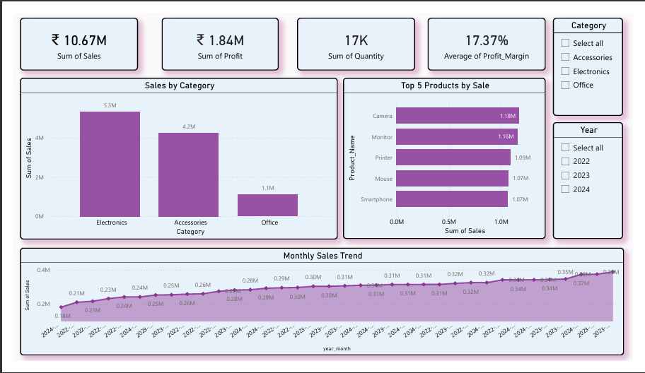

# E-commerce Sales Analysis

## Dashboard Preview
## 📊 Dashboard Preview

## Executive Summary

This project focuses on analysing E-commerce sales data to deduce the key business insights such as product performance, sales trend and profitability. The analysis was performed using SQL for the purpose of data cleaning and transformation, followed by Power BI for interactive dashboard development. The objective was to convert the raw dataset available to us into meaningful insight which ensures effective business decision making. The final dashboard enables stakeholders to monitor the sales trend, identify the top performing categories and evaluate the overall profit margins.

## Business Problem

E-commerce business generates a large volume of data (3500 records in this dataset), but the raw data alone is not enough to provide us with actionable insights. The core business challenges in this project were to understand the overall sales performance, identify top performing categories and products and calculate the profit trend over time. Without properly analysing, it is difficult for decision makers to identify which areas drive revenue growth and where optimization in strategy is required. Thus, this project aims to bridge the gap through structured data analysis and visualization.

## Methodology

The project followed a structured analytical workflow. First, the raw dataset was imported into MySQL, where data cleaning was performed, including duplicates handling and checking column formats. Derived measures like profit margin and total sales were calculated. The cleaned dataset was then imported into Power BI, where additional transformation was performed using the Power Query Editor. Later, an interactive dashboard was developed featuring KPI cards, Category wise analysis, product level insights, and monthly trend of sales. A mobile layout was also created to ensure cross-device usability.

## Skills

MySQL- Data Cleaning, Querying and Creating Calculated Measures

Power BI- DAX, Data Visualization and Transformation 

## Results 

The analysis helped to infer meaningful patterns in sales and profitability. Certain product categories were identified as primary revenue drivers, while higher profit margin indicated areas with stronger profitability performance. Monthly trend analysis indicated overall sales growth over time with noticeable fluctuations across the period. The top product analysis showed the dominance of certain products in significantly contributing to total sales, suggesting opportunities for marketing strategies.

## Business Recommendations

Based on the analysis, the business must prioritize the high performing product categories to maximise the revenue. Products contributing to sales out of proportion should receive targeted marketing and inventory support. Profitability can be improved by monitoring the profit margin across various categories that can help us to identify where cost or pricing adjustments can be done.

